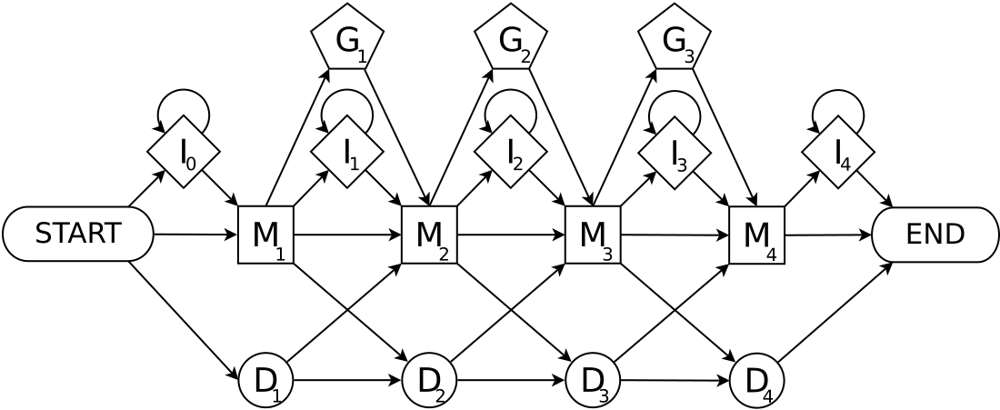

PathRacer: racing profile HMM paths on assembly graph
=====================================================
MANUAL
------

### Overview
<!-- PathRacer is assembly graph against profile HMM aligning tool supporting -->
<!-- both _local-local_ and _global-local_ (aka _glocal_) alignment and both nucleotide and amino acid profile HMMs. -->
<!-- The tool finds all proper alignments rather than only the best one. -->
<!-- That allows extracting all genes satisfying HMM gene model from the assembly. -->
<!--  -->

**PathRacer** is a tool for alignment of assembly graph against pHMM. It provides
the set of _k_ most probable paths traversed by a HMM through the whole assembly
graph. It supports both nucleotide and amino-acid pHMMs performing nt-to-aa
translation on-fly walking through frameshifts.

**PathRacer** has two versions: main `pathracer` is for aliening both nucleotide and amino-acid pHMMs against assembly graphs and
`pathracer-seq-fs` is for aligning amino-acid pHMMs against separate sequences allowing indels in the nucleotide space.
`pathracer` is supposed to be used on complex metagenome assembly graphs for fragmented gens assembly and annotation.
`pathracer-fs-seq` is supposed to be used as a replacement of original **HMMer** for sequences with high indel rate, e.g., PacBio/ONT contigs.

Both tool use extended pHMM model allowing frame shifts:



but for `pathracer-seq-fs` this extension is crucial: for aligning amino-acid pHMMs without allowing indels in the nucleotide space
`hmmsearch` from **HMMer** package is more than enough.

### Input
Currently the tool supports only _de Bruijn_ graphs in GFA format as produced by **SPAdes** or compatible assembler in this matter (e.g., **MEGAHIT**).
Contact us if you need some other format support. Input sequences are supposed to be in FASTA/FASTQ format.

Profile HMM should be in **HMMer3** format, but one can pass nucleotide or amino acid sequences as well.
These sequences will be converted to proxy pHMMs.
Aligning of these pHMMs would be equivalent to performing alignment using Levenshtein distance for each input sequence.


### `pathracer` command line options
Required positional arguments:

1. Query file (.hmm file or .fasta)
2. Assembly graph in GFA format
3. _k_ (_de Bruijn_ vertex overlap size) for the input graph

Main options:

- `--output`, `-o` DIR: output directory
- `--hmm` | `--nt` | `--aa`: perform match against pHMM(s) [default] | nucleotide sequences | amino acid sequences
- `--queries` Q1 [Q2 [...]]: queries names to lookup [default: all queries from input query file]
- `--edges` E1 [E2 [...]]: match around particular edges [default: all graph edges]
- `--global` | `--local`: perform HMM-global, graph-local (aka _glocal_, default) or HMM-local, graph-local HMM matching
- `--length`, `-l` L: minimal length of resultant matched sequence; if &le;1 then to be multiplied on aligned HMM length [default: 0.9]
- `--indel-rate`, `-r` RATE: expected rate of nucleotides indels in graph edges [default: 0]. Used for AA pHMM aligning with frameshifts
- `--top` N: extract up to _N_ top scored paths [default: 10000]; only unique paths are reported and therefore
- `--rescore`: rescore resulting paths by **HMMer** and produce output tables in **HMMer** standard formats
- `--threads`, `-t` T: the total number of CPU threads to use [default: 16]
- `--parallel-components`: process connected components of neighborhood subgraph in parallel
- `--memory`, `-m` M: RAM limit in GB (**PathRacer** terminates if the limit is exceeded) [default: 100]
- `--annotate-graph`: emit paths in GFA graph

Heuristics options:

- `--max-size` MAX\_SIZE: maximal component size to consider [default: INF]
- `--max-insertion-length`: maximal allowed number of successive I-emissions [default: 30]
- `--no-top-score-filter`: disable top score Event Graph vertices filter. Increases sensitivity of deep analysis (`--top` &gt; 50000)

Debug output control:

- `--debug`: enable extensive debug console output
- `--draw`: draw pictures around the interesting edges
- `--export-event-graph`: export Event Graph in .cereal format

_In addition:_ Some other developer options that are not supposed to be tuned by the end-user. Could be removed in further releases.

### `pathracer` output
For each input pHMM (gene model) `pathracer` reports:

- **&lt;gene\_name&gt;.seqs.fa**: sequences correspondent to _N_ best scored paths ordered by score along with their alignment in CIGAR format
- **&lt;gene\_name&gt;.nucls.fa**: _(for amino acids pHHMs only)_ the same sequences in nucleotides
- **&lt;gene\_name&gt;.edges.fa**: unique graph edge paths sequences corresponding to best scored paths
- **&lt;gene\_name&gt;.{domtblout, pfamtblout, tblout}**: _(optional)_ edge paths realignment by **HMMer** in various default output formats
- **event\_graph\_&lt;gene\_name&gt;\_component\_&lt;component\_id&gt;\_size\_&lt;component\_size&gt;.cereal**: _(optional, debug output)_ connected components of the event graph graph
- **&lt;component\_id&gt;.dot**: _(optional, plot)_ connected component of matched neighborhood subgraph
- **&lt;component\_id&gt;\_&lt;path\_index&gt;.dot**: _(optional, plot)_ neighborhood of the found path

In addition:

- **all.edges.fa**: unique edge paths for all pHMMs in one file
- **pathracer.log**: log file
- **graph\_with\_hmm\_paths.gfa**: _(optional)_ input graph with top scored paths added

### `pathracer-seq-fs` command line options
Required positional arguments:

1. Query .hmm file (.fasta is not supported yet)
2. Sequence file (.fasta or .fastq)

Main options:

- `--output`, `--queries`, `--global | --local`, `--top`, `--threads`, `--memory`: the same as in main `pathracer`
- `--sequences` S1 [S2 [...]]: sequence IDs to process [default: all input sequences]
- `--indel-rate`, `-r` RATE: expected rate of nucleotides indels in graph edges [default: 0.05]. Used for AA pHMM aligning with frameshifts
- `--max-fs` N: maximal allowed number of frameshifts in a reported sequence [default: 10]
- `--cutoff` CUTOFF: bitscore cutoff for reported match; if <= 1 then to be multiplied on GA HMM cutoff [default: 0.7]",

Heuristics options:
_The same as in main `pathracer`_

### `pathracer-seq-fs` output
For each input pHMM (gene model): **&lt;gene\_name&gt;.seqs.fa** and **&lt;gene\_name&gt;.nucls.fa**, the same as in main `pathracer`


### Output files format
**&lt;gene\_name&gt;.seqs.fa** and **&lt;gene\_name&gt;.nucls.fa** files contain metainformation in FASTA headers.
For main `pathracer` the header format is:
><code>
<span>&gt;</span>Score=_PathRacer score_|Edges=_edges path_|Position=_starting position on the first edge_|Alignment=_CIGAR alignment_
</code>

E.g.:
><code>
<span>&gt;</span>Score=366.239|Edges=255162_24353'|Position=9210|Alignment=186M2D186M
</code>

Prime (') after an edge ID means reverse complement

For `pathracer-seq-fs` the header format is:
><code>
<span>&gt;</span>Score=_PathRacer score_|Bitscore=_HMMer bitscore for the whole sequence without incomplete codons_|PartialBitscore=_Maximal HMMer bitscore for fragment between frameshifts_|Seq=_Sequence ID_|Position=_Starting position in the sequence_|Frameshifts=_#Frameshifts_|Alignment=_CIGAR alignment_
</code>

E.g.
><code>
<span>&gt;</span>Score=342.689|Bitscore=539.274|PartialBitscore=238.41|Seq=RB12-N|Position=2935|Alignment=55M1G1M1D20M1D14M1I3M2D11M1P1M1D64M1D62M1D1M1G23M1D30M  
MSLYRRLVLLSCLSWPLAGFSATALTNLVAEPFAKLEQDFGGSIGVYAMDTGSGA=CSYR  
AEERFPLCSSFKGFLAAVLARSQQGRLAGHTHPLRQNALVPWSPIS-KYLTTGMTVAELS  
AAAVQYSDNAAANLLLKELGGPAGLTAFMRSIGDTTFRLDRWELELNSAIRAMRAIPHRR  
ARDGKLTKLTLGSALAAPQRQQFVDWLKGNTTGNHRIRAAVPADWAVGDKTGTCG=YGTA  
NDYAVVWPTGRAPIVLAVYRAPNKDDKHSEAVIAAAARLALEDWASTAV
</code>

For alignment with frameshifts the extemded CIGAR/FASTA is used:
P/"-" &mdash; one nucleotide insertion, G/"=" &mdash; two nucleotides insertion


### Examples
One can download example datasets from here <http://cab.spbu.ru/software/pathracer/>

- **urban_strain.gfa**: strain assembly graph of Singapore clinical isolation ward wastewater metagenome (SRA accession SRR5997548, dataset H1)
- **bla\_all.hmm**: 159 beta-lactamase family pHMMs from **AMRFinder** database <https://www.ncbi.nlm.nih.gov/pathogens/antimicrobial-resistance/AMRFinder/>
- **ecoli\_mc.gfa**: assembly graph of _E. coli str. K12 substr. MG1655_ multicell isolate (SRA accession ERA000206)
- **bac.hmm**: _16S_, _23S_, and _5S_ ribosomal subunit pHMMs
- **synth\_strain\_gbuilder.gfa**: strain assembly graph of SYNTH mock metagenome dataset (SRA accession SRR606249)
- **synth16S\_new.fa**: _16S_ rRNA sequences of SYNTH organisms obtained from [SILVA](https://www.arb-silva.de/) database
- **plasmids-ONT.fa**: 7 ONT-assembled AMR-related plasmids from [Li et al, 2018](https://www.ncbi.nlm.nih.gov/pubmed/29325009)

Lookup for beta-lactamase genes (amino acid pHMMs) in Singapore wastewater  
```
pathracer bla_all.hmm urban_strain.gfa 55 --output pathracer_urban_strain_bla_all
```

Lookup for beta-lactamase genes (amino acid pHMMs) in AMR ONT plasmids (many indels!)   
```
pathracer-fs-seq bla_all.hmm plasmids-ONT.fa --output pathracer_plasmids_ont_bla_all
```

Lookup for _16S_/_5S_/_23S_ (nucleotide HMMs) in _E.coli_ multicell assembly  
```
pathracer bac.hmm ecoli_mc.gfa 55 --output pathracer_ecoli_mc_bac
```

Lookup for known _16S_ sequences in _E.coli_ multicell assembly  
```
pathracer synth16S_new.fa ecoli_mc.gfa 55 --nt --output pathracer_ecoli_mc_16S_seqs
```

Lookup for known _16S_ sequences in SYNTH mock metagenome assembly  
```
pathracer synth16S_new.fa synth_strain_gbuilder.gfa 55 --nt --output pathracer_synth_strain_gbuider_16S_seqs
```

Let us extract **all** _16S_ sequences from SYNTH mock metagenome assembly.
For this we increase `--top` and disable Event Graph vertices filter (`--no-top-score-filter`)
Deep analysis of extremely complicated dataset also require stack and memory limits tuning  
```
ulimit -s unlimited &&  
export OMP_STACKSIZE=1G  
pathracer bac.hmm synth_strain_gbuilder.gfa 55 --queries 16S_rRNA -m 250 --top 1000000 --output pathracer_synth_strain_gbuilder_16s --no-top-score-filter
```

### References
If you are using **PathRacer** in your research, please cite:  
A. Shlemov and A. Korobeynikov. PathRacer: racing profile HMM paths on assembly
graph. In _Proceedings of International Conference on Algorithms for Computational Biology,
AlCoB 2019. Berkeley, California, USA, May 28&ndash;30, 2019,_ volume 11488 LNCS, pages
80&ndash;94, 2019.  
<https://link.springer.com/chapter/10.1007/978-3-030-18174-1_6>

In case of any problems running **PathRacer** please contact SPAdes support <spades.support@cab.spbu.ru> attaching the log file.
Your suggestions are also very welcome!
