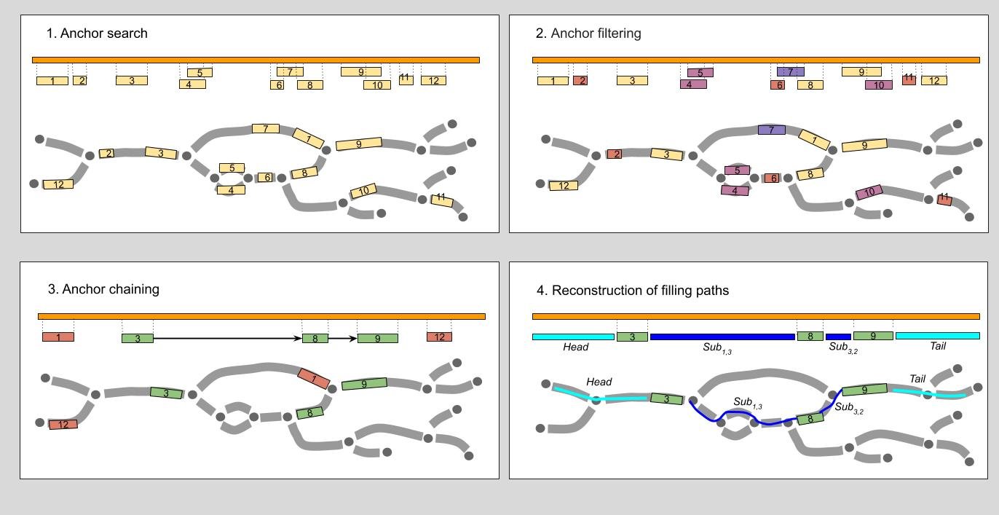

# SPAligner

Tool for fast and accurate alignment of nucleotide sequences (s.a. long reads, coding sequences, etc.) to assembly graphs. 


## Main pipeline

Overview of the alignment of query sequence *S* (orange bar) to assembly graph *G*. Assembly graph edges are considered directed left-to-right (explicit edge orientation was omitted to improve the clarity).



1. **Hit search.** Hits (regions of high similarity) between the query and the edge labels are identified with [BWA-MEM](http://bio-bwa.sourceforge.net/). 
2. **Hit filtering.** Hits shorter than *K*, assembly graph *K*-mer size,(hits 5, 6, 9), hits “in the middle” of long edge (hit 4) or ambiguous hits (hit 7 mostly covered by hit 2, both hits 11 and 12) are discarded.
3. **Hit chaining.** Heaviest chain of compatible hits (chain 1->3->2) is determined.
4. **Reconstruction of filling paths.** Paths for fragments of the query between the consecutive chain hits (as well as left- and right-most fragments) are reconstructed. The procedure is performed using fast library for sequence alignment [Edlib](https://github.com/Martinsos/edlib).

## Compilation

    git clone https://github.com/ablab/spades.git
    cd algorithmic-biology/assembler/
    mkdir build && cd build && cmake ../src
    make spaligner


## Running SPAligner


To align PacBio reads realpb.fasta (accepts fasta/fastq files) to *E.coli* assembly graph built for K=77 (dataset is available [here](https://figshare.com/s/004baf22fc1bfd758f5b "Figshare DB")):
``` 
spaligner spaligner_config.yaml -K 77 -d pacbio -g ecoli.gfa -s realpb.fasta -o test_ecoli
```
By default, spaligner_config.yaml will be installed into /usr/share/spaligner/. Alignments will be saved to test_ecoli.tsv.

Run *help* to see full list of options:
```
spaligner -h
```


## Results interpretation

SPAligner can represent the results in three formats: *.tsv (default), *.fasta and [*.gpa](https://github.com/ocxtal/gpa "GPA-format spec").
Each line in tsv-file represents alignments of a single read.


**Example 1**

```
name    0      2491  536  1142  2491	44+,24+,22+,1+,38-	909,4,115,1,1142	AAACTTTTATTGTGCATACGGCGATTAAGACGGGAAAAGTCGGTGAT...
```

name — read name<br/>
0 — start position of alignment on read<br/>
2491 — end position of  alignment on read<br/>
536 — start position of alignment on the first edge of the Path (here on edge with id=44)<br/>
1142 —  end position of alignment on the last edge of the Path (here on conjugate edge to edge with id=38)<br/>
2491 — read length<br/>
44+,24+,22+,1+,38- — Path of the alignment <br/>
909,4,115,1,1142 — lengths of the alignment on each edge of the Path respectively (44+,24+,22+,1+,38-) <br/>
AGGTTGTTTTTTGTTTCTTCCGC... — sequence of alignment Path <br/>


**Example 2**<br/>

Sometimes read alignment on the graph can be represented as several non-overlapping subpaths (if there is no alignment with appropriate score between two consecutive bwa hits). <br/>
So, there can be several unconnected alignments of read onto assembly graph and several start positions, end positions, paths etc.:

```
name     4,10  7,19       2,7   5,6       19    123+;288-,128+       3;3,6 GAT;TTATCCGGG
```

The read *name* has two alignments on the graph:

1. The first alignment starts on read on position 4 and ends on position 7.
Corresponding path consists of a single edge 123+ (i.e. 123+) with start on position 2 and end on position 5.
Path sequence: GAT.
2. While the second alignment covers the end of the read, starting on read on position 10 and ending on position 19. 
Corresponding path consists of two edges 288- and 128+ (i.e. 288-,128+) with start on position 7 (on 288-) and end on position 6 (on 128+).
Path sequence: TTATCCGGG.

If a read was not fully aligned, SPAligner tries to prolong the longest alignment subpath in order to reconstruct a full alignment path. In **Example 2** SPAligner was not able to prolong any of two given alignments.


## Future plans 

1. Add amino acid sequence support.
2. Alignment speed-up.
